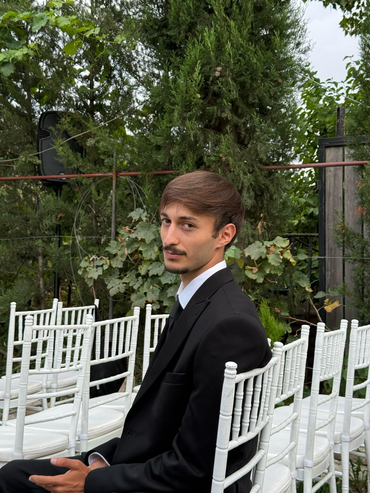

# EPAM HR Department Recommendations

# Full Name

Levan Salamashvili

# Photo



# Contact Information

- Email: salamashvili21@gmail.com
- Phone: +995 593 122 703
- GitHub: https://github.com/Lewyyshub
- Discord: levan salamashvili
- Location: Tbilisi, Georgia

# Brief Self-Introduction

I am a junior frontend developer focused on building responsive and accessible web interfaces.
My priorities are continuous learning, writing clean maintainable code and delivering user-centered experiences.
I enjoy React, TypeScript and modern CSS. I build educational projects.

# Skills

**Languages & Markup:** JavaScript (ES6+), TypeScript, HTML5, CSS3, SASS, TailwindCSS  
**Frameworks & Libraries:** React, Next.js, Tailwind CSS  
**Tools & Platforms:** Git, GitHub, VS Code, Figma, Chrome DevTools

# English Language
- **Proficiency Level:** B2 (Upper-Intermediate)  

# Education
- **ReEducate** — Tbilisi, 2024–2025  

# Projects and Work Experience
 
- **[Fridge Magnets App](https://magneto-eight.vercel.app/)** — Built with Next.js, JavaScript & TailwindCss.
- **[Password Generator](https://my-app-seven-liart-65.vercel.app/)** — Built with TypeScript and TailwindCss.


# Code Example (Codewars) — Sum of two lowest positive integers

```javascript
function sumTwoSmallestNumbers(numbers) {
  const sorted = numbers.filter((n) => n > 0).sort((a, b) => a - b);
  return sorted[0] + sorted[1];
}

console.log(sumTwoSmallestNumbers([19, 5, 42, 2, 77]));
```
